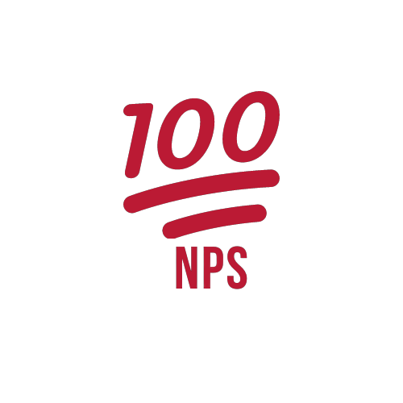

___

    

     

    
        
        
        
        
    
    <a href ="https://github.com/alissonpratesperes/netpromoterscore/blob/main/LICENSE" target="_blank">

     

    <a href="#dart-sobre">Sobre</a>&nbsp;&nbsp;&nbsp;|&nbsp;&nbsp;&nbsp;
    <a href="#battery-tecnologias">Tecnologias</a>&nbsp;&nbsp;&nbsp;|&nbsp;&nbsp;&nbsp;
    <a href="#electric_plug-execute">Execute</a>&nbsp;&nbsp;&nbsp;|&nbsp;&nbsp;&nbsp;
    <a href="#fuelpump-autor">Autor</a>&nbsp;&nbsp;&nbsp;|&nbsp;&nbsp;&nbsp;
    <a href="#memo-licença">Licença</a>

     

## :dart: Sobre
A **NetPromoterScore** é uma aplicação que consiste em calcular o NPS através do cadastro de usuários, cadastro de pesquisas e envio de e-mail para as avaliações. Nela fazemos a pesquisa de satisfação através deste fluxo e com isso a computação do cálculo do NPS.

## :battery: Tecnologias
Essa Aplicação foi desenvolvida utilizando as seguintes tecnologias:

- <a href="https://web.postman.co/">Postman</a>
- <a href="https://nodejs.org/">NodeJS</a>
- <a href="https://www.typescriptlang.org/">TypeScript</a>
- <a href="https://expressjs.com/">Express</a>
- <a href="https://typeorm.io/">TypeORM</a>
- <a href="https://sqlite.org/">SQLite 3</a>
- <a href="https://handlebarsjs.com/">Handlebars</a>
- <a href="https://nodemailer.com/">NodeMailer</a>
- <a href="https://github.com/jquense/yup">Yup</a>
- <a href="https://jestjs.io/">Jest</a>

## :electric_plug: Execute

    - Clonar o Repositório.
    - Instalar as dependências do Back-End com o comando: ">_ npm install --force":
        |- Executar os Testes Automatizados com o comando: ">_ npm run test";
            > Inicializar o Back-End com o comando: ">_ npm run dev".

## :fuelpump: Autor
Projeto desenvolvido durante a **Next Level Week 04** da <a href="https://rocketseat.com.br/">Rocketseat</a> na *trilha de desenvolvimento: **NodeJS***, ocorrida em **Fevereiro de 2021**;

Acesse <a href="https://github.com/rocketseat-education/nlw-04-nodejs/">aqui</a> o **repositório oficial** da aplicação.

## :memo: Licença
Esse projeto está sob a **Licença MIT**. Veja o arquivo [LICENSE](https://github.com/alissonpratesperes/netpromoterscore/blob/main/LICENSE) para mais detalhes.

___

<h5 align="center">👨🏻‍💻&nbsp;com&nbsp;💜&nbsp;por&nbsp;<a href="https://github.com/alissonpratesperes">Alisson Prates Peres</a>&nbsp;✌🏻😗</h5>